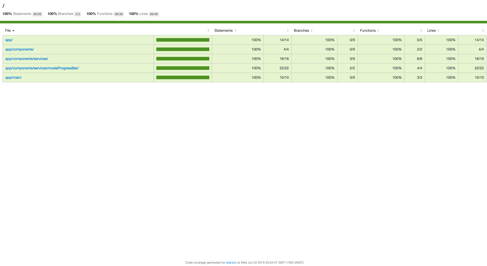

# Modal Progress Bar Application

 

## Prerequisites
1. Install node.
2. Install git.
3. Install bower and grunt-cli globally using `npm install -g bower grunt-cli http-server`.

## Building the project
1. Clone this git repository.
2. cd into the cloned directory.
3. Run `npm install` to install npm and bower dependencies.
4. Run `npm run serve` to start the application in development mode.
5. The application will be served at [http://localhost:9000](http://localhost:9000) .

## All Commands

1. Run `npm run test` to run unit tests. Code coverage results can be viewed from ./coverage/report-lcov/lcov-report/index.html. The screenshot for the same is attached below.

2. Run `npm run serve` to run the application in development mode.
3. Run `npm run build` to create distribution files for the application in `dist` folder. The distribution files can be tested using `cd dist` and `http-server -p 9001 .` Browse the application at [http://localhost:9001](http://localhost:9001) .
